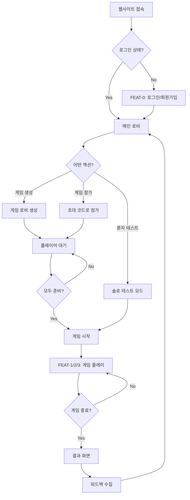
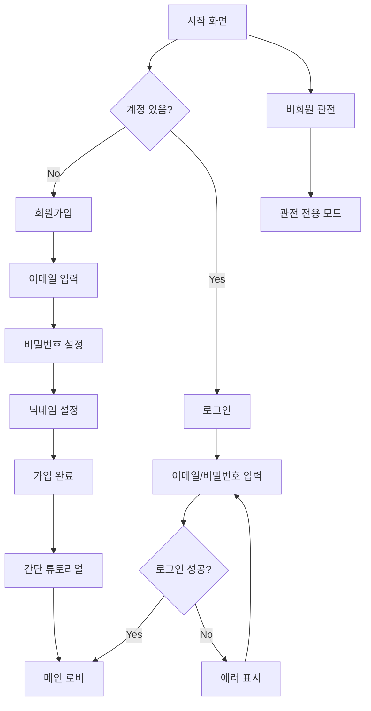
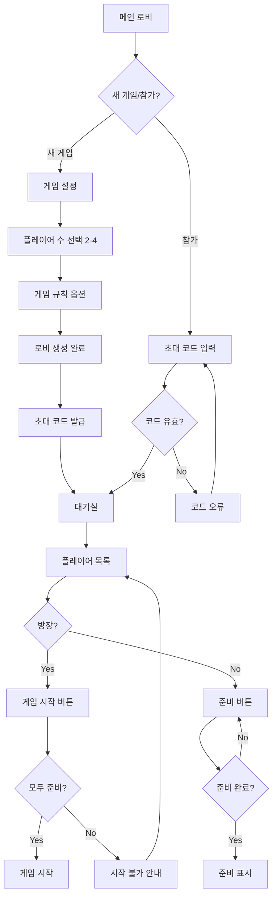
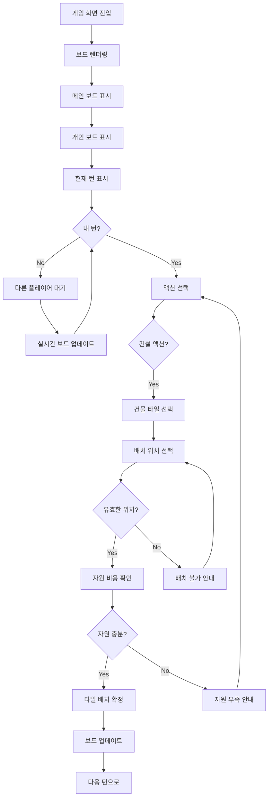
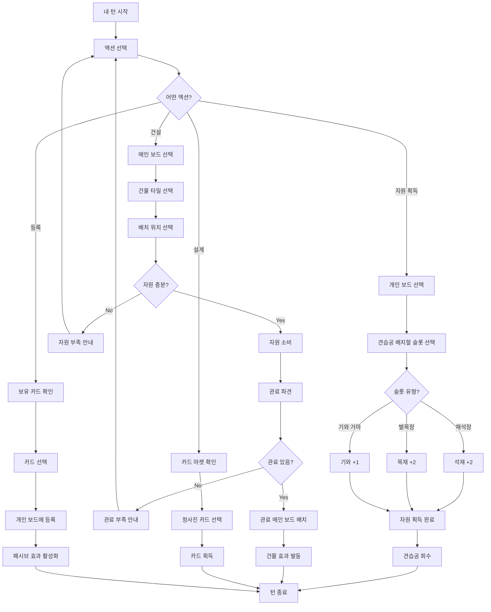
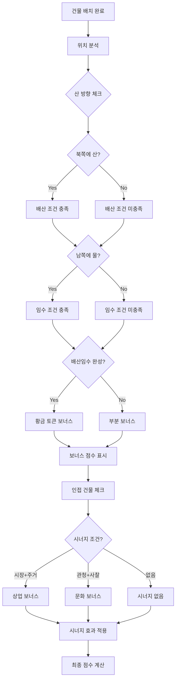
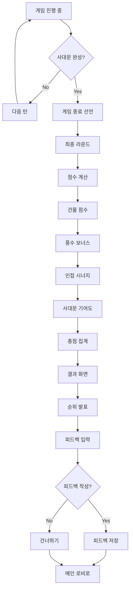
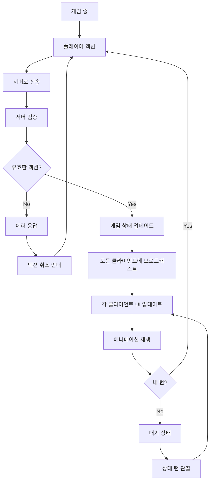
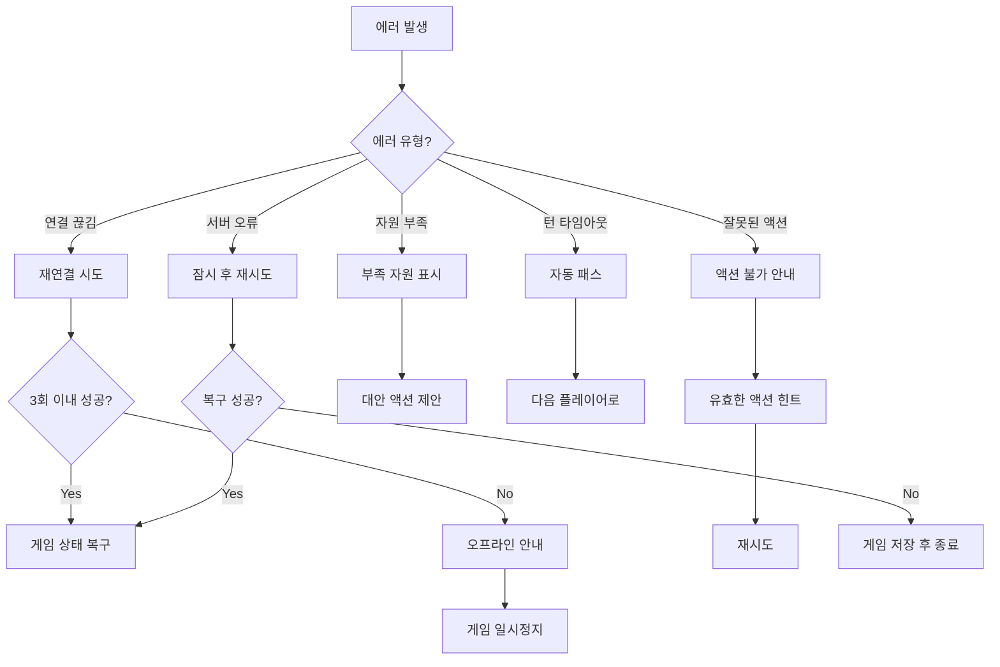

# User Flow (사용자 흐름도)

> Hanyang: The Foundation - 사용자 여정 및 화면 흐름

---

## MVP 캡슐

| # | 항목 | 내용 |
|---|------|------|
| 1 | 목표 | 보드게임 프로토타입을 디지털로 테스트하여 실제 제작 전 밸런싱 검증 |
| 2 | 페르소나 | 보드게임 동호회 회원 및 게임 디자이너 본인 |
| 3 | 핵심 기능 | FEAT-2: 워커 파견 및 자원 관리 (전략적 선택의 핵심) |
| 4 | 성공 지표 (노스스타) | 동호회원 5명이 완전한 게임 1판 테스트 완료 |
| 5 | 입력 지표 | 테스트 세션 수, 수집된 피드백 수 |
| 6 | 비기능 요구 | 빠른 게임 시작 (3분 이내 세팅), 실시간 멀티플레이 지원 |
| 7 | Out-of-scope | AI 상대, 랭킹 시스템, 모바일 네이티브 앱 |
| 8 | Top 리스크 | 복잡한 게임 룰로 인한 구현 난이도 |
| 9 | 완화/실험 | 핵심 메카닉(워커/자원)부터 점진적 구현 |
| 10 | 다음 단계 | 기본 게임 보드 UI 및 워커 배치 로직 구현 |

---

## 1. 전체 사용자 여정 (Overview)



---

## 2. FEAT-0: 온보딩/로그인 플로우



---

## 3. 게임 로비 플로우



---

## 4. FEAT-1: 게임 보드 및 타일 배치 플로우



---

## 5. FEAT-2: 워커 파견 및 자원 관리 플로우 (MVP)



---

## 6. FEAT-3: 풍수지리 보너스 플로우



---

## 7. 게임 종료 플로우



---

## 8. 실시간 동기화 플로우



---

## 9. 에러 처리 플로우



---

## 10. 화면 목록 (Screen Inventory)

| 화면 ID | 화면명 | FEAT | 진입점 | 주요 액션 |
|---------|--------|------|--------|----------|
| S-01 | 시작 화면 | FEAT-0 | URL 접속 | 로그인/가입/관전 선택 |
| S-02 | 로그인 | FEAT-0 | S-01 | 이메일/비밀번호 입력 |
| S-03 | 회원가입 | FEAT-0 | S-01 | 계정 생성 |
| S-04 | 메인 로비 | - | S-02 | 게임 생성/참가 |
| S-05 | 게임 설정 | - | S-04 | 플레이어 수, 규칙 설정 |
| S-06 | 대기실 | - | S-05 | 플레이어 대기, 준비 |
| S-07 | 게임 화면 | FEAT-1/2/3 | S-06 | 게임 플레이 |
| S-08 | 개인 보드 | FEAT-2 | S-07 | 자원 관리, 카드 등록 |
| S-09 | 메인 보드 | FEAT-1/3 | S-07 | 타일 배치, 워커 파견 |
| S-10 | 결과 화면 | - | S-07 | 점수 확인, 피드백 |

---

## 11. 화면 상세

### S-07: 게임 화면 레이아웃

```
┌─────────────────────────────────────────────────────────────┐
│ [턴 표시] 현재: 플레이어2  라운드: 3/8   [설정] [나가기]   │
├─────────────────────────────────────────────────────────────┤
│                                                             │
│                    ┌─────────────────┐                      │
│                    │                 │                      │
│                    │   메인 보드     │                      │
│    플레이어1       │   (한양 지도)   │       플레이어2      │
│    [프로필]        │                 │       [프로필]       │
│    자원: ...       │   N(산)         │       자원: ...      │
│                    │   ┌───┬───┐     │                      │
│                    │   │   │   │     │                      │
│                    │   ├───┼───┤     │                      │
│                    │   │   │   │     │                      │
│                    │   └───┴───┘     │                      │
│                    │   S(물)         │                      │
│    플레이어3       │                 │       플레이어4      │
│    [프로필]        └─────────────────┘       [프로필]       │
│    자원: ...                                 자원: ...      │
│                                                             │
├─────────────────────────────────────────────────────────────┤
│ ┌───────────────────────────────────────────────────────┐   │
│ │              내 개인 보드 (건축가의 책상)              │   │
│ │  ┌────┐ ┌────┐ ┌────┐     자원: 목 석 기 먹          │   │
│ │  │채석│ │벌목│ │기와│            2  3  1  2          │   │
│ │  └────┘ └────┘ └────┘                                 │   │
│ │  [견습공 3/5]  [관료 2/4]                             │   │
│ └───────────────────────────────────────────────────────┘   │
├─────────────────────────────────────────────────────────────┤
│ [드래프팅] [자원획득] [건설] [등록]          [턴 종료]      │
└─────────────────────────────────────────────────────────────┘
```

---

## Decision Log 참조

| ID | 항목 | 선택 | 근거 |
|----|------|------|------|
| D-03 | UI 스타일 | Board Game Arena 스타일 | 깔끔하고 기능적인 2D |
| D-08 | 게임 화면 | 메인보드 중앙 + 개인보드 하단 | 중요한 정보 중심 배치 |
| D-09 | 액션 버튼 | 하단 고정 | 빠른 액션 접근성 |
