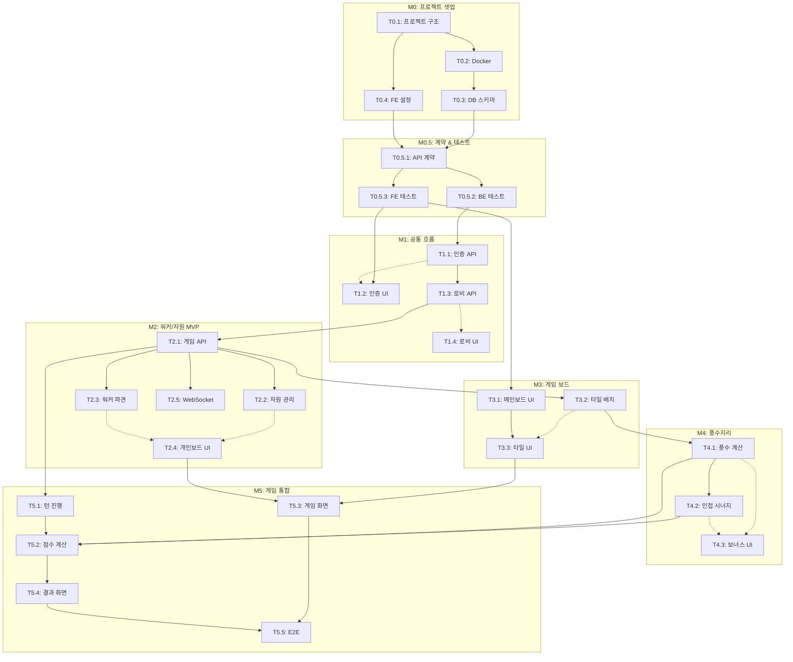

# TASKS: Hanyang: The Foundation - AI 개발 파트너용 태스크 목록

> 조선 초기 한양 건설 전략 보드게임 - 디지털 프로토타입

---

## MVP 캡슐

| # | 항목 | 내용 |
|---|------|------|
| 1 | 목표 | 보드게임 프로토타입을 디지털로 테스트하여 실제 제작 전 밸런싱 검증 |
| 2 | 페르소나 | 보드게임 동호회 회원 및 게임 디자이너 본인 |
| 3 | 핵심 기능 | FEAT-2: 워커 파견 및 자원 관리 (전략적 선택의 핵심) |
| 4 | 성공 지표 (노스스타) | 동호회원 5명이 완전한 게임 1판 테스트 완료 |
| 5 | 입력 지표 | 테스트 세션 수, 수집된 피드백 수 |
| 6 | 비기능 요구 | 빠른 게임 시작 (3분 이내 세팅), 실시간 멀티플레이 지원 |
| 7 | Out-of-scope | AI 상대, 랭킹 시스템, 모바일 네이티브 앱 |
| 8 | Top 리스크 | 복잡한 게임 룰로 인한 구현 난이도 |
| 9 | 완화/실험 | 핵심 메카닉(워커/자원)부터 점진적 구현 |
| 10 | 다음 단계 | 기본 게임 보드 UI 및 워커 배치 로직 구현 |

---

## 마일스톤 개요

| 마일스톤 | 설명 | 주요 기능 | Phase |
|----------|------|----------|-------|
| M0 | 프로젝트 셋업 | 환경 구성, Docker, 프로젝트 구조 | Phase 0 |
| M0.5 | 계약 & 테스트 설계 | API 계약, 테스트 스켈레톤, Mock | Phase 0 |
| M1 | FEAT-0 공통 흐름 | 인증, 로비 시스템 | Phase 1 |
| M2 | FEAT-2 워커/자원 (MVP) | 워커 파견, 자원 관리 | Phase 2 |
| M3 | FEAT-1 게임 보드 | 메인보드, 타일 배치 | Phase 3 |
| M4 | FEAT-3 풍수지리 | 배산임수 보너스 | Phase 4 |
| M5 | 게임 플로우 통합 | 턴 진행, 종료 조건, 점수 계산 | Phase 5 |

---

## M0: 프로젝트 셋업

### [] Phase 0, T0.1: 프로젝트 구조 초기화

**담당**: frontend-specialist + backend-specialist

**작업 내용**:
- 모노레포 구조 생성 (frontend/, backend/, contracts/)
- 기본 설정 파일 생성 (package.json, pyproject.toml)
- .gitignore, .env.example 설정

**산출물**:
- `frontend/package.json`
- `frontend/vite.config.ts`
- `backend/pyproject.toml`
- `backend/app/__init__.py`
- `contracts/types.ts`

**완료 조건**:
- [ ] `npm create vite@latest frontend -- --template react-ts` 성공
- [ ] `cd backend && pip install -e .` 성공

---

### [] Phase 0, T0.2: Docker Compose 설정

**담당**: backend-specialist

**작업 내용**:
- PostgreSQL 16 + Redis 7 컨테이너 설정
- 볼륨 마운트 설정
- 환경 변수 구성

**산출물**:
- `docker-compose.yml`
- `.env.example`

**완료 조건**:
- [ ] `docker compose up -d` 성공
- [ ] PostgreSQL 연결 확인 (`psql` 테스트)
- [ ] Redis 연결 확인 (`redis-cli ping`)

---

### [] Phase 0, T0.3: 데이터베이스 스키마 초기화

**담당**: database-specialist

**작업 내용**:
- SQLAlchemy 모델 정의 (User, Lobby, Game, GamePlayer)
- Alembic 마이그레이션 설정
- 마스터 데이터 시드 (BuildingTile, BlueprintCard)

**산출물**:
- `backend/app/models/user.py`
- `backend/app/models/game.py`
- `backend/app/models/master_data.py`
- `backend/alembic/versions/001_initial.py`
- `backend/scripts/seed_master_data.py`

**완료 조건**:
- [ ] `alembic upgrade head` 성공
- [ ] 마스터 데이터 시드 완료 (건물 10개 이상)

---

### [] Phase 0, T0.4: 프론트엔드 기본 설정

**담당**: frontend-specialist

**작업 내용**:
- TailwindCSS + Design System 색상 설정
- Zustand 스토어 구조
- React Router 설정
- ky API 클라이언트 설정

**산출물**:
- `frontend/tailwind.config.js` (Design System 색상)
- `frontend/src/stores/gameStore.ts`
- `frontend/src/stores/authStore.ts`
- `frontend/src/services/api.ts`
- `frontend/src/App.tsx` (라우팅)

**완료 조건**:
- [ ] `npm run dev` 성공
- [ ] TailwindCSS 색상 적용 확인

---

## M0.5: 계약 & 테스트 설계

### [] Phase 0, T0.5.1: API 계약 정의

**담당**: backend-specialist + frontend-specialist

**작업 내용**:
- TypeScript 타입 정의 (contracts/)
- Pydantic 스키마 정의 (동기화)
- WebSocket 메시지 타입 정의

**산출물**:
- `contracts/types.ts` (GameState, Player, Resource, Action)
- `contracts/auth.contract.ts`
- `contracts/lobby.contract.ts`
- `contracts/game.contract.ts`
- `contracts/ws-messages.ts`
- `backend/app/schemas/auth.py`
- `backend/app/schemas/game.py`
- `backend/app/schemas/action.py`

**완료 조건**:
- [ ] TypeScript 타입과 Pydantic 스키마 1:1 매칭
- [ ] 모든 API 엔드포인트 계약 정의 완료

---

### [] Phase 0, T0.5.2: 백엔드 테스트 스켈레톤

**담당**: test-specialist

**작업 내용**:
- pytest 설정 (conftest.py)
- 각 API별 테스트 파일 생성 (빈 테스트)
- Factory Boy 팩토리 정의

**산출물**:
- `backend/tests/conftest.py`
- `backend/tests/api/test_auth.py` (스켈레톤)
- `backend/tests/api/test_lobby.py` (스켈레톤)
- `backend/tests/api/test_game.py` (스켈레톤)
- `backend/tests/factories.py`

**완료 조건**:
- [ ] `pytest --collect-only` 성공 (테스트 케이스 수집)
- [ ] 모든 테스트 SKIP 상태 (구현 전)

---

### [] Phase 0, T0.5.3: 프론트엔드 테스트 & Mock 설정

**담당**: test-specialist

**작업 내용**:
- Vitest 설정
- MSW Mock 핸들러 설정
- 컴포넌트 테스트 스켈레톤

**산출물**:
- `frontend/vitest.config.ts`
- `frontend/src/mocks/handlers/auth.ts`
- `frontend/src/mocks/handlers/lobby.ts`
- `frontend/src/mocks/handlers/game.ts`
- `frontend/src/mocks/data/gameState.ts`
- `frontend/src/__tests__/setup.ts`

**완료 조건**:
- [ ] `npm run test` 성공 (MSW 로드 확인)
- [ ] Mock 데이터로 API 호출 테스트 가능

---

## M1: FEAT-0 공통 흐름

### [] Phase 1, T1.1: 회원가입/로그인 API RED→GREEN

**담당**: backend-specialist

**Git Worktree 설정**:
```bash
# 1. Worktree 생성
git worktree add ../hanyang-phase1-auth -b phase/1-auth
cd ../hanyang-phase1-auth

# 2. 작업 완료 후 병합 (사용자 승인 필요)
# git checkout main
# git merge phase/1-auth
# git worktree remove ../hanyang-phase1-auth
```

**TDD 사이클**:

1. **RED**: 테스트 작성 (실패 확인)
   ```bash
   # 테스트 파일: backend/tests/api/test_auth.py
   pytest backend/tests/api/test_auth.py -v  # Expected: FAILED
   ```

2. **GREEN**: 최소 구현 (테스트 통과)
   ```bash
   # 구현 파일: backend/app/routers/auth.py
   # 구현 파일: backend/app/services/auth_service.py
   pytest backend/tests/api/test_auth.py -v  # Expected: PASSED
   ```

3. **REFACTOR**: 리팩토링 (테스트 유지)

**산출물**:
- `backend/tests/api/test_auth.py` (테스트)
- `backend/app/routers/auth.py` (구현)
- `backend/app/services/auth_service.py` (구현)
- `backend/app/core/security.py` (JWT, bcrypt)

**인수 조건**:
- [ ] POST /api/v1/auth/register 테스트 통과
- [ ] POST /api/v1/auth/login 테스트 통과
- [ ] POST /api/v1/auth/refresh 테스트 통과
- [ ] 커버리지 >= 80%

---

### [] Phase 1, T1.2: 로그인/회원가입 UI RED→GREEN

**담당**: frontend-specialist

**의존성**: T1.1 - **Mock 사용으로 독립 개발 가능**

**Git Worktree 설정**:
```bash
git worktree add ../hanyang-phase1-auth-fe -b phase/1-auth-fe
cd ../hanyang-phase1-auth-fe
```

**Mock 설정**:
```typescript
// frontend/src/mocks/handlers/auth.ts 활용
```

**TDD 사이클**:

1. **RED**: 테스트 작성
   ```bash
   # 테스트 파일: frontend/src/__tests__/pages/Login.test.tsx
   npm run test -- src/__tests__/pages/Login.test.tsx  # Expected: FAILED
   ```

2. **GREEN**: 최소 구현
   ```bash
   # 구현 파일: frontend/src/pages/Login.tsx
   # 구현 파일: frontend/src/pages/Register.tsx
   npm run test -- src/__tests__/pages/Login.test.tsx  # Expected: PASSED
   ```

**산출물**:
- `frontend/src/__tests__/pages/Login.test.tsx`
- `frontend/src/__tests__/pages/Register.test.tsx`
- `frontend/src/pages/Login.tsx`
- `frontend/src/pages/Register.tsx`
- `frontend/src/hooks/useAuth.ts`

**인수 조건**:
- [ ] 로그인 폼 렌더링 테스트 통과
- [ ] 회원가입 폼 렌더링 테스트 통과
- [ ] Mock API 연동 테스트 통과

---

### [] Phase 1, T1.3: 로비 시스템 API RED→GREEN

**담당**: backend-specialist

**Git Worktree 설정**:
```bash
git worktree add ../hanyang-phase1-lobby -b phase/1-lobby
cd ../hanyang-phase1-lobby
```

**TDD 사이클**:

1. **RED**: 테스트 작성
   ```bash
   # 테스트 파일: backend/tests/api/test_lobby.py
   pytest backend/tests/api/test_lobby.py -v  # Expected: FAILED
   ```

2. **GREEN**: 최소 구현
   ```bash
   # 구현 파일: backend/app/routers/lobby.py
   # 구현 파일: backend/app/services/lobby_service.py
   pytest backend/tests/api/test_lobby.py -v  # Expected: PASSED
   ```

**산출물**:
- `backend/tests/api/test_lobby.py`
- `backend/app/routers/lobby.py`
- `backend/app/services/lobby_service.py`

**인수 조건**:
- [ ] POST /api/v1/lobbies (로비 생성) 테스트 통과
- [ ] GET /api/v1/lobbies/{id} (로비 조회) 테스트 통과
- [ ] POST /api/v1/lobbies/{id}/join (참가) 테스트 통과
- [ ] POST /api/v1/lobbies/{id}/ready (준비) 테스트 통과
- [ ] POST /api/v1/lobbies/{id}/start (시작) 테스트 통과
- [ ] 초대 코드 생성 및 검증 로직 테스트 통과

---

### [] Phase 1, T1.4: 로비 UI RED→GREEN

**담당**: frontend-specialist

**의존성**: T1.3 - **Mock 사용으로 독립 개발 가능**

**Git Worktree 설정**:
```bash
git worktree add ../hanyang-phase1-lobby-fe -b phase/1-lobby-fe
cd ../hanyang-phase1-lobby-fe
```

**TDD 사이클**:

1. **RED**: 테스트 작성
   ```bash
   npm run test -- src/__tests__/pages/Lobby.test.tsx  # Expected: FAILED
   ```

2. **GREEN**: 최소 구현
   ```bash
   npm run test -- src/__tests__/pages/Lobby.test.tsx  # Expected: PASSED
   ```

**산출물**:
- `frontend/src/__tests__/pages/Lobby.test.tsx`
- `frontend/src/pages/Lobby.tsx`
- `frontend/src/pages/LobbyList.tsx`
- `frontend/src/components/lobby/PlayerList.tsx`
- `frontend/src/components/lobby/InviteCode.tsx`

**인수 조건**:
- [ ] 로비 생성 UI 테스트 통과
- [ ] 초대 코드 입력 UI 테스트 통과
- [ ] 플레이어 목록 표시 테스트 통과
- [ ] 준비/시작 버튼 테스트 통과

---

## M2: FEAT-2 워커/자원 (MVP 핵심)

### [] Phase 2, T2.1: 게임 상태 모델 및 API RED→GREEN

**담당**: backend-specialist

**Git Worktree 설정**:
```bash
git worktree add ../hanyang-phase2-game -b phase/2-game
cd ../hanyang-phase2-game
```

**TDD 사이클**:

1. **RED**: 테스트 작성
   ```bash
   pytest backend/tests/api/test_game.py -v  # Expected: FAILED
   ```

2. **GREEN**: 최소 구현
   ```bash
   pytest backend/tests/api/test_game.py -v  # Expected: PASSED
   ```

**산출물**:
- `backend/tests/api/test_game.py`
- `backend/tests/services/test_game_service.py`
- `backend/app/routers/game.py`
- `backend/app/services/game_service.py`

**인수 조건**:
- [ ] GET /api/v1/games/{id} (게임 상태 조회) 테스트 통과
- [ ] POST /api/v1/games/{id}/action (액션 수행) 테스트 통과
- [ ] 게임 상태 JSONB 직렬화/역직렬화 테스트 통과

---

### [] Phase 2, T2.2: 자원 관리 로직 RED→GREEN

**담당**: backend-specialist

**Git Worktree 설정**:
```bash
git worktree add ../hanyang-phase2-resource -b phase/2-resource
cd ../hanyang-phase2-resource
```

**TDD 사이클**:

1. **RED**: 테스트 작성
   ```bash
   pytest backend/tests/services/test_resource.py -v  # Expected: FAILED
   ```

2. **GREEN**: 최소 구현
   ```bash
   pytest backend/tests/services/test_resource.py -v  # Expected: PASSED
   ```

**산출물**:
- `backend/tests/services/test_resource.py`
- `backend/app/services/resource_service.py`
- `backend/app/utils/game_validator.py`

**인수 조건**:
- [ ] 자원 추가 테스트 통과 (add_resource)
- [ ] 자원 소비 테스트 통과 (consume_resource)
- [ ] 자원 부족 검증 테스트 통과
- [ ] 자원 타입별 처리 (wood, stone, tile, ink)

---

### [] Phase 2, T2.3: 워커 파견 로직 RED→GREEN

**담당**: backend-specialist

**Git Worktree 설정**:
```bash
git worktree add ../hanyang-phase2-worker -b phase/2-worker
cd ../hanyang-phase2-worker
```

**TDD 사이클**:

1. **RED**: 테스트 작성
   ```bash
   pytest backend/tests/services/test_worker.py -v  # Expected: FAILED
   ```

2. **GREEN**: 최소 구현
   ```bash
   pytest backend/tests/services/test_worker.py -v  # Expected: PASSED
   ```

**산출물**:
- `backend/tests/services/test_worker.py`
- `backend/app/services/worker_service.py`

**인수 조건**:
- [ ] 견습공 배치 테스트 (개인 보드 → 자원 슬롯)
- [ ] 견습공 회수 테스트 (턴 종료 시)
- [ ] 관료 파견 테스트 (메인 보드 영구 배치)
- [ ] 워커 가용성 검증 테스트

---

### [] Phase 2, T2.4: 개인 보드 UI RED→GREEN

**담당**: frontend-specialist

**의존성**: T2.2, T2.3 - **Mock 사용으로 독립 개발 가능**

**Git Worktree 설정**:
```bash
git worktree add ../hanyang-phase2-personal-board -b phase/2-personal-board
cd ../hanyang-phase2-personal-board
```

**Mock 설정**:
```typescript
// frontend/src/mocks/data/gameState.ts
export const mockGameState: GameState = {
  players: [{
    resources: { wood: 2, stone: 3, tile: 1, ink: 2 },
    workers: {
      apprentices: { total: 5, available: 3 },
      officials: { total: 4, available: 2 }
    }
  }]
};
```

**TDD 사이클**:

1. **RED**: 테스트 작성
   ```bash
   npm run test -- src/__tests__/components/board/PersonalBoard.test.tsx
   ```

2. **GREEN**: 최소 구현
   ```bash
   npm run test -- src/__tests__/components/board/PersonalBoard.test.tsx
   ```

**산출물**:
- `frontend/src/__tests__/components/board/PersonalBoard.test.tsx`
- `frontend/src/components/board/PersonalBoard.tsx`
- `frontend/src/components/board/ResourceDisplay.tsx`
- `frontend/src/components/board/WorkerSlot.tsx`

**인수 조건**:
- [ ] 자원 표시 컴포넌트 테스트 통과
- [ ] 워커 슬롯 렌더링 테스트 통과
- [ ] 견습공 배치 인터랙션 테스트 통과

---

### [] Phase 2, T2.5: WebSocket 실시간 통신 RED→GREEN

**담당**: backend-specialist + frontend-specialist

**Git Worktree 설정**:
```bash
git worktree add ../hanyang-phase2-websocket -b phase/2-websocket
cd ../hanyang-phase2-websocket
```

**TDD 사이클**:

1. **RED**: 테스트 작성
   ```bash
   # BE
   pytest backend/tests/ws/test_game_ws.py -v
   # FE
   npm run test -- src/__tests__/hooks/useWebSocket.test.ts
   ```

2. **GREEN**: 최소 구현
   ```bash
   pytest backend/tests/ws/test_game_ws.py -v
   npm run test -- src/__tests__/hooks/useWebSocket.test.ts
   ```

**산출물**:
- `backend/tests/ws/test_game_ws.py`
- `backend/app/routers/websocket.py`
- `frontend/src/__tests__/hooks/useWebSocket.test.ts`
- `frontend/src/hooks/useWebSocket.ts`

**인수 조건**:
- [ ] WebSocket 연결 테스트 통과
- [ ] 게임 상태 브로드캐스트 테스트 통과
- [ ] 액션 전송/수신 테스트 통과
- [ ] 재연결 로직 테스트 통과

---

## M3: FEAT-1 게임 보드

### [] Phase 3, T3.1: 메인 보드 렌더링 RED→GREEN

**담당**: frontend-specialist

**Git Worktree 설정**:
```bash
git worktree add ../hanyang-phase3-mainboard -b phase/3-mainboard
cd ../hanyang-phase3-mainboard
```

**TDD 사이클**:

1. **RED**: 테스트 작성
   ```bash
   npm run test -- src/__tests__/components/board/MainBoard.test.tsx
   ```

2. **GREEN**: 최소 구현 (React-Konva)
   ```bash
   npm run test -- src/__tests__/components/board/MainBoard.test.tsx
   ```

**산출물**:
- `frontend/src/__tests__/components/board/MainBoard.test.tsx`
- `frontend/src/components/board/MainBoard.tsx`
- `frontend/src/components/board/BoardGrid.tsx`
- `frontend/src/components/board/TerrainLayer.tsx` (산/물 표시)

**인수 조건**:
- [ ] 5x5 그리드 렌더링 테스트 통과
- [ ] 지형(산, 물) 표시 테스트 통과
- [ ] 반응형 크기 조절 테스트 통과

---

### [] Phase 3, T3.2: 타일 배치 로직 RED→GREEN

**담당**: backend-specialist

**Git Worktree 설정**:
```bash
git worktree add ../hanyang-phase3-tile -b phase/3-tile
cd ../hanyang-phase3-tile
```

**TDD 사이클**:

1. **RED**: 테스트 작성
   ```bash
   pytest backend/tests/services/test_tile_placement.py -v
   ```

2. **GREEN**: 최소 구현
   ```bash
   pytest backend/tests/services/test_tile_placement.py -v
   ```

**산출물**:
- `backend/tests/services/test_tile_placement.py`
- `backend/app/services/tile_service.py`

**인수 조건**:
- [ ] 빈 칸 배치 검증 테스트 통과
- [ ] 자원 비용 검증 테스트 통과
- [ ] 배치 후 보드 상태 업데이트 테스트 통과

---

### [] Phase 3, T3.3: 타일 배치 UI RED→GREEN

**담당**: frontend-specialist

**의존성**: T3.2 - **Mock 사용으로 독립 개발 가능**

**Git Worktree 설정**:
```bash
git worktree add ../hanyang-phase3-tile-ui -b phase/3-tile-ui
cd ../hanyang-phase3-tile-ui
```

**TDD 사이클**:

1. **RED**: 테스트 작성
   ```bash
   npm run test -- src/__tests__/components/board/TilePlacement.test.tsx
   ```

2. **GREEN**: 최소 구현
   ```bash
   npm run test -- src/__tests__/components/board/TilePlacement.test.tsx
   ```

**산출물**:
- `frontend/src/__tests__/components/board/TilePlacement.test.tsx`
- `frontend/src/components/board/BuildingTile.tsx`
- `frontend/src/components/board/TileSelector.tsx`

**인수 조건**:
- [ ] 타일 선택 UI 테스트 통과
- [ ] 유효 위치 하이라이트 테스트 통과
- [ ] 배치 확정 인터랙션 테스트 통과

---

## M4: FEAT-3 풍수지리

### [] Phase 4, T4.1: 풍수지리 보너스 계산 RED→GREEN

**담당**: backend-specialist

**Git Worktree 설정**:
```bash
git worktree add ../hanyang-phase4-fengshui -b phase/4-fengshui
cd ../hanyang-phase4-fengshui
```

**TDD 사이클**:

1. **RED**: 테스트 작성
   ```bash
   pytest backend/tests/services/test_fengshui.py -v
   ```

2. **GREEN**: 최소 구현
   ```bash
   pytest backend/tests/services/test_fengshui.py -v
   ```

**산출물**:
- `backend/tests/services/test_fengshui.py`
- `backend/app/services/fengshui_service.py`

**인수 조건**:
- [ ] 배산 조건 검증 테스트 통과 (북쪽에 산)
- [ ] 임수 조건 검증 테스트 통과 (남쪽에 물)
- [ ] 배산임수 완성 보너스 테스트 통과
- [ ] 부분 조건 보너스 테스트 통과

---

### [] Phase 4, T4.2: 인접 시너지 계산 RED→GREEN

**담당**: backend-specialist

**Git Worktree 설정**:
```bash
git worktree add ../hanyang-phase4-adjacency -b phase/4-adjacency
cd ../hanyang-phase4-adjacency
```

**TDD 사이클**:

1. **RED**: 테스트 작성
   ```bash
   pytest backend/tests/services/test_adjacency.py -v
   ```

2. **GREEN**: 최소 구현
   ```bash
   pytest backend/tests/services/test_adjacency.py -v
   ```

**산출물**:
- `backend/tests/services/test_adjacency.py`
- `backend/app/services/adjacency_service.py`

**인수 조건**:
- [ ] 시장+주거 시너지 테스트 통과
- [ ] 관청+사찰 시너지 테스트 통과
- [ ] 다중 시너지 누적 테스트 통과

---

### [] Phase 4, T4.3: 보너스 표시 UI RED→GREEN

**담당**: frontend-specialist

**의존성**: T4.1, T4.2 - **Mock 사용으로 독립 개발 가능**

**Git Worktree 설정**:
```bash
git worktree add ../hanyang-phase4-bonus-ui -b phase/4-bonus-ui
cd ../hanyang-phase4-bonus-ui
```

**TDD 사이클**:

1. **RED**: 테스트 작성
   ```bash
   npm run test -- src/__tests__/components/game/BonusDisplay.test.tsx
   ```

2. **GREEN**: 최소 구현
   ```bash
   npm run test -- src/__tests__/components/game/BonusDisplay.test.tsx
   ```

**산출물**:
- `frontend/src/__tests__/components/game/BonusDisplay.test.tsx`
- `frontend/src/components/game/BonusDisplay.tsx`
- `frontend/src/components/game/FengshuiIndicator.tsx`

**인수 조건**:
- [ ] 풍수지리 보너스 토스트 테스트 통과
- [ ] 인접 시너지 표시 테스트 통과
- [ ] 애니메이션 렌더링 테스트 통과

---

## M5: 게임 플로우 통합

### [] Phase 5, T5.1: 턴 진행 시스템 RED→GREEN

**담당**: backend-specialist

**Git Worktree 설정**:
```bash
git worktree add ../hanyang-phase5-turn -b phase/5-turn
cd ../hanyang-phase5-turn
```

**TDD 사이클**:

1. **RED**: 테스트 작성
   ```bash
   pytest backend/tests/services/test_turn.py -v
   ```

2. **GREEN**: 최소 구현
   ```bash
   pytest backend/tests/services/test_turn.py -v
   ```

**산출물**:
- `backend/tests/services/test_turn.py`
- `backend/app/services/turn_service.py`

**인수 조건**:
- [ ] 턴 시작 처리 테스트 통과
- [ ] 액션 후 턴 종료 테스트 통과
- [ ] 라운드 종료 및 다음 라운드 전환 테스트 통과
- [ ] 모든 플레이어 순환 테스트 통과

---

### [] Phase 5, T5.2: 게임 종료 및 점수 계산 RED→GREEN

**담당**: backend-specialist

**Git Worktree 설정**:
```bash
git worktree add ../hanyang-phase5-scoring -b phase/5-scoring
cd ../hanyang-phase5-scoring
```

**TDD 사이클**:

1. **RED**: 테스트 작성
   ```bash
   pytest backend/tests/services/test_scoring.py -v
   ```

2. **GREEN**: 최소 구현
   ```bash
   pytest backend/tests/services/test_scoring.py -v
   ```

**산출물**:
- `backend/tests/services/test_scoring.py`
- `backend/app/services/scoring_service.py`
- `backend/app/utils/score_calculator.py`

**인수 조건**:
- [ ] 사대문 완성 종료 조건 테스트 통과
- [ ] 건물 점수 계산 테스트 통과
- [ ] 풍수지리 보너스 합산 테스트 통과
- [ ] 최종 순위 결정 테스트 통과

---

### [] Phase 5, T5.3: 게임 화면 통합 RED→GREEN

**담당**: frontend-specialist

**Git Worktree 설정**:
```bash
git worktree add ../hanyang-phase5-game-ui -b phase/5-game-ui
cd ../hanyang-phase5-game-ui
```

**TDD 사이클**:

1. **RED**: 테스트 작성
   ```bash
   npm run test -- src/__tests__/pages/Game.test.tsx
   ```

2. **GREEN**: 최소 구현
   ```bash
   npm run test -- src/__tests__/pages/Game.test.tsx
   ```

**산출물**:
- `frontend/src/__tests__/pages/Game.test.tsx`
- `frontend/src/pages/Game.tsx`
- `frontend/src/components/game/ActionPanel.tsx`
- `frontend/src/components/game/TurnIndicator.tsx`

**인수 조건**:
- [ ] 전체 게임 화면 레이아웃 테스트 통과
- [ ] 액션 패널 통합 테스트 통과
- [ ] 턴 표시 및 전환 테스트 통과

---

### [] Phase 5, T5.4: 결과 화면 RED→GREEN

**담당**: frontend-specialist

**Git Worktree 설정**:
```bash
git worktree add ../hanyang-phase5-result -b phase/5-result
cd ../hanyang-phase5-result
```

**TDD 사이클**:

1. **RED**: 테스트 작성
   ```bash
   npm run test -- src/__tests__/pages/Result.test.tsx
   ```

2. **GREEN**: 최소 구현
   ```bash
   npm run test -- src/__tests__/pages/Result.test.tsx
   ```

**산출물**:
- `frontend/src/__tests__/pages/Result.test.tsx`
- `frontend/src/pages/Result.tsx`
- `frontend/src/components/game/ScoreBoard.tsx`
- `frontend/src/components/game/FeedbackForm.tsx`

**인수 조건**:
- [ ] 순위 표시 테스트 통과
- [ ] 점수 상세 내역 표시 테스트 통과
- [ ] 피드백 폼 제출 테스트 통과

---

### [] Phase 5, T5.5: E2E 테스트 작성

**담당**: test-specialist

**Git Worktree 설정**:
```bash
git worktree add ../hanyang-phase5-e2e -b phase/5-e2e
cd ../hanyang-phase5-e2e
```

**작업 내용**:
- Playwright E2E 테스트 시나리오 작성
- 전체 게임 플로우 테스트

**산출물**:
- `frontend/e2e/auth.spec.ts`
- `frontend/e2e/lobby.spec.ts`
- `frontend/e2e/game-flow.spec.ts`

**인수 조건**:
- [ ] 로그인 → 로비 생성 → 게임 시작 플로우 테스트 통과
- [ ] 한 라운드 진행 E2E 테스트 통과
- [ ] 게임 종료 및 결과 확인 E2E 테스트 통과

---

## 의존성 그래프



---

## 병렬 실행 가능 태스크

| Phase | 병렬 실행 가능 태스크 | 조건 |
|-------|----------------------|------|
| Phase 0 | T0.3, T0.4 | T0.1, T0.2 완료 후 |
| Phase 0 | T0.5.2, T0.5.3 | T0.5.1 완료 후 |
| Phase 1 | T1.1, T1.2 | Mock 사용 시 완전 병렬 |
| Phase 1 | T1.3, T1.4 | Mock 사용 시 완전 병렬 |
| Phase 2 | T2.2, T2.3 | T2.1 완료 후 |
| Phase 2 | T2.4, T2.5 | Mock 사용 시 T2.1 이후 병렬 |
| Phase 3 | T3.1, T3.2 | M2 완료 후 |
| Phase 4 | T4.1, T4.2 | 독립적으로 병렬 가능 |
| Phase 5 | T5.3, T5.4 | T5.1, T5.2 완료 후 |

---

## 체크리스트

### TASKS 문서 검증

- [x] 모든 태스크 ID에 Phase 접두사 포함
- [x] 모든 Phase 1+ 태스크에 Git Worktree 설정 포함
- [x] 모든 Phase 1+ 태스크에 TDD 사이클 포함
- [x] 의존성 있는 태스크에 Mock 설정 포함
- [x] 각 태스크 독립적으로 실행 가능
- [x] 병렬 실행 가능 태스크 테이블 포함
- [x] 의존성 그래프 (Mermaid) 포함
